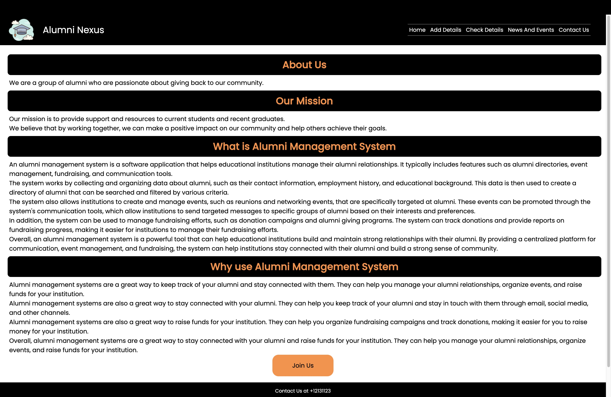
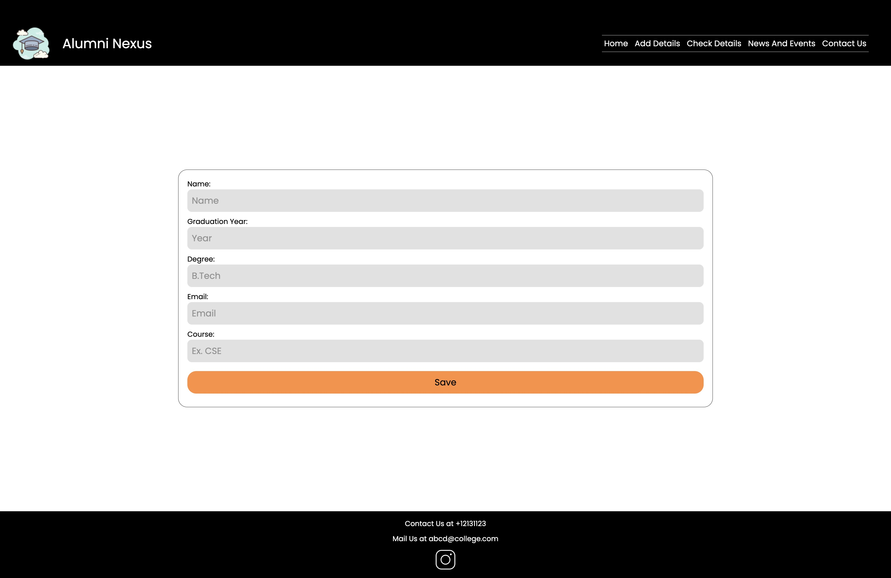
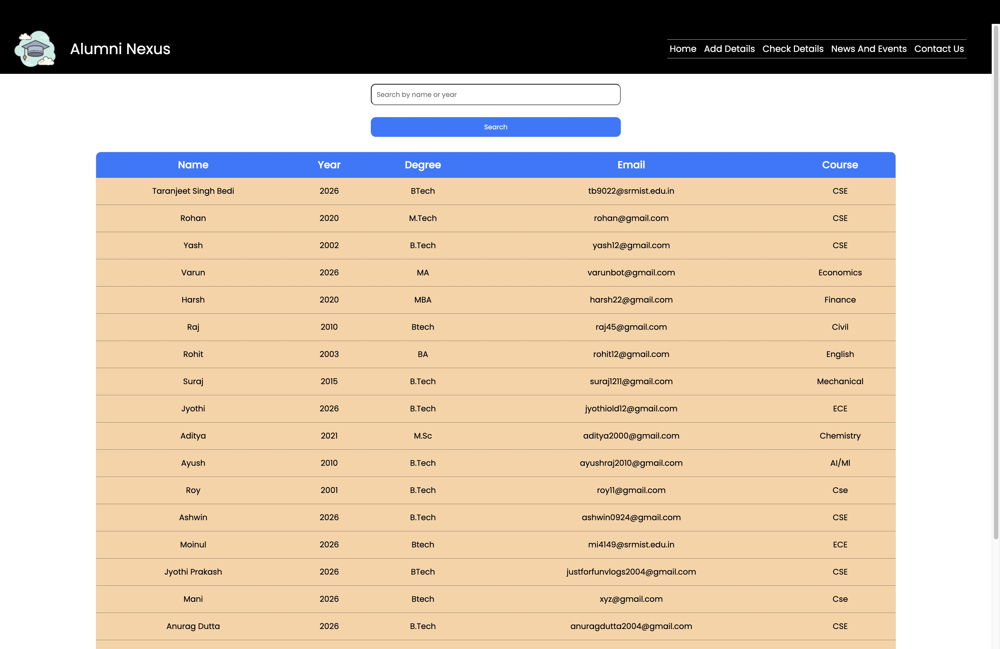

<h1>Alumni Nexus</h1>

This project works as Alumni Management System and has Postgresql and Cloud Database Support. It is made using Django and HTML, CSS
<h2>General Information</h2>

<ul>
<li>It works as a portal for students to connect and view contact of their alumni. They can search for registered users and find their details.</li>
</ul><ul>
<li>It works as a connection between the juniors and the seniors, or as a meet up point for batchmates.</li>
</ul><ul>
<li>It can act as a portal for sharing job and other career based events</li>
</ul><h2>Technologies Used</h2>

<ul align="center">
 

 
 
</ul><h2>Screenshots</h2>

<h2>Setup</h2>
</ul><h2>Features</h2>

<ul>
<li>Cloud Database</li>
</ul><ul>
<li>Events and News</li>
</ul><h2>Setup</h2>

Prerequisites :
Download all the packages given in requirements.txt
<h5>Steps</h5><ul>
<li>Download. : git clone https://github.com/TartejBrothers/Alumni-nexus.git</li>
</ul><ul>
<li>Run : python3 manage.py runserver</li>
</ul><h2>Project Status</h2>

The events page doesn't have the backend setup. It will accessible to the users who have saved their data on the portal, and will push the event to the admin for final approval.
<h2>Improvements</h2>

<ul>
<li>Speeding Up The Server</li>
</ul><ul>
<li>Fixing the UI on Safari IOS</li>
</ul><h2>Features that can be added</h2>

<ul>
<li>Events Page Backend</li>
</ul><ul>
<li>Data Entry Page for Events Page</li>
</ul><h2>Contact</h2>

